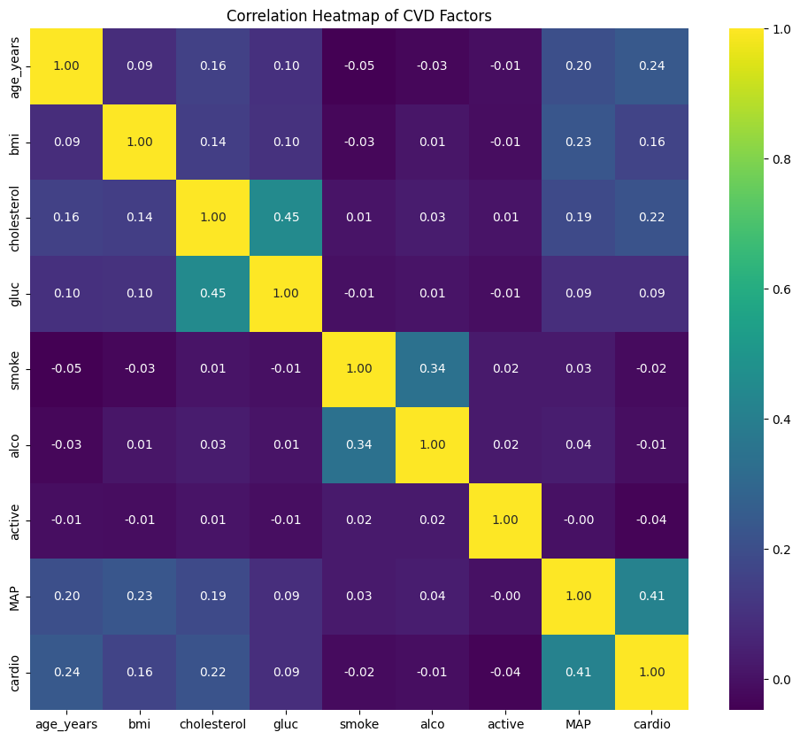
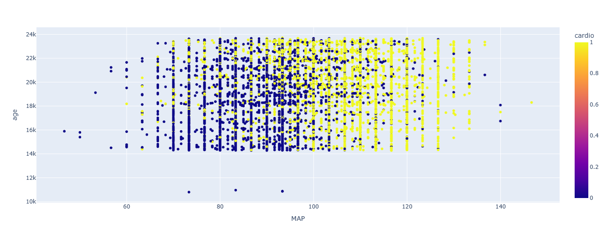
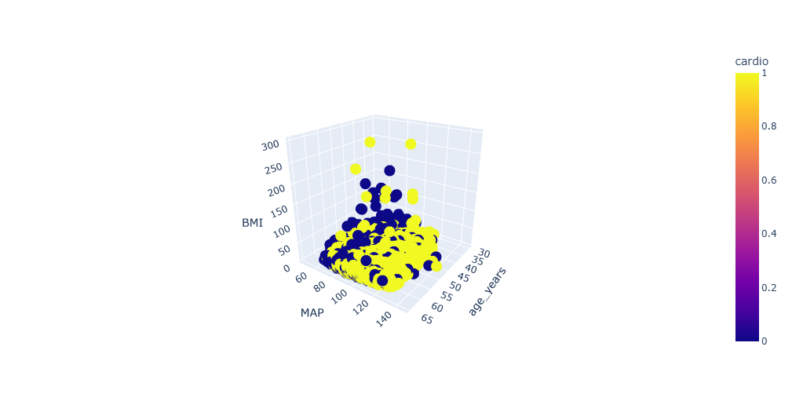
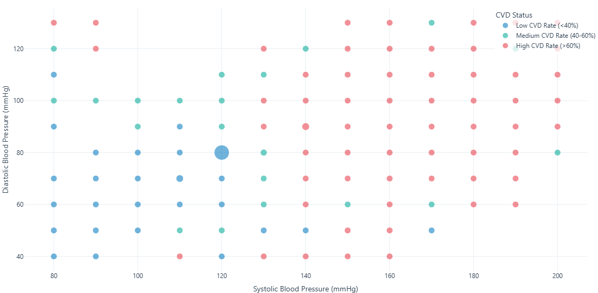

# Cardiovascular Disease Prediction

DSA project template for the Bootcamp on Nov 1st, 2025. 

Provide a [link to your dataset](https://www.kaggle.com/datasets/sulianova/cardiovascular-disease-dataset/data) 

Briefly _explain_ your **hypothesis**.
We are trying to make a prediction of Cardiovascular disease based on multiple factors ranging from lab tests to lifestyle habits. We will try to narrow down those factors to the ones that give the best prediction, and calculate the accuracy of our model.

[Our Presentation Pt 1](CVD_Prediction_pt_2.html)

[Our Presentation Pt 2](Untitled1.html)

All factor correlataion heat-map

MAP - Mean Arterial Blood Pressure VS Age Vs CVD

3D - Age Vs BMI Vs MAP

.png)

BMI vs Age CVD

.png)

Cholesterol Vs Age Vs CVD

.png)

Age Vs CVD

BP Vs CVD

## Factors
1. MAP - Mean Arterial pressure
2. Smoking
3. Alcohol
4. blood Cholesterol Levels
5. Glucose Cholesterol Levels
6. Age
7. BMI - Body Mass Index
